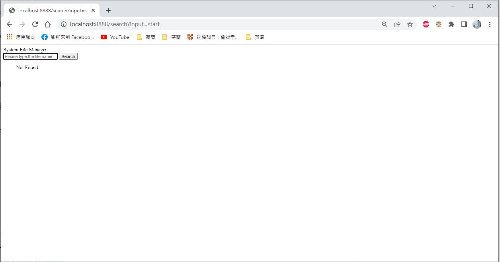
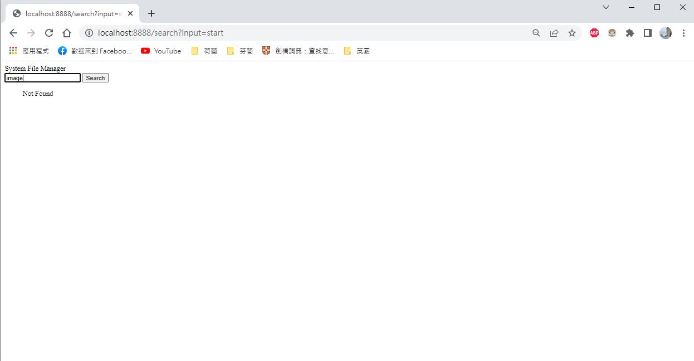
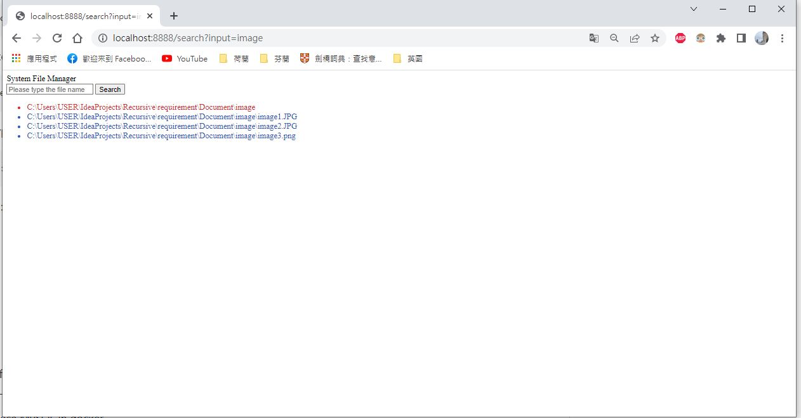

# WebFileSystem
This is a file search system in web. 

By typing the name of file or the folder, it could list all the filee or foldere path which contains the indicated word in the name.

Feel free to play with this.

**Demo**
.gif)

## MUST NEED BEFORE USED
- [x] Docker
- [x] Java 17
- [x] maven

## How to use-By command line
* Switch to the Recursive folder
* Open MySQL database in docker
 ``` docker
docker-compose -f docker-compose.yaml up --build -d
```

* Install necessary maven dependency( when running the first time)
``` 
mvn install
```
* Compile Java file
``` 
mvn clean compile
```
* Execute Java file
 ``` docker
mvn exec:java
```

* Type the URL in the brower
 ``` docker
http://localhost:8888/search?input=start
```
**Step 1 : The initial screen**



**Step 2 : Type the name of the file and folder in the search bar and press the search botton**



**Step 3 : The result show below** 



**Hips:**
If add new file in the root folder, just re-run java file without restart docker.
The new file would be added to MySQL.

* Close MySQL in docker
``` docker
docker-compose -f docker-compose.yaml down
```
* Clear memory space
 ``` docker
docker system prune -f
```

## Tech in the FileSystemSearch
* Java 17
* Maven 
* Docker 
* MySQL 5.7
* httpserver
